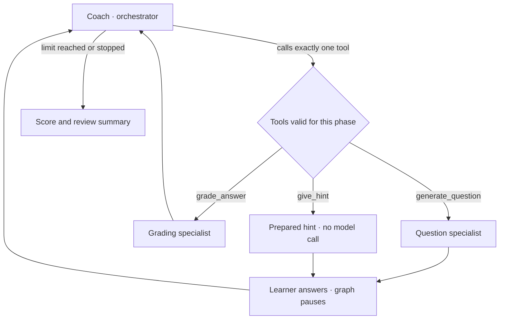

# QuizPilot

AI quiz coach built with Python and LangGraph featuring an orchestrator agent, specialist agents as tools, personalized questions, and resumable sessions.

QuizPilot guides you through a topic using three agent roles powered by one shared language model. When you start a live quiz, you choose a subject, such as Java collections.The coach agent acts as the orchestrator, choosing a suitable focus based on your topic, current difficulty, previous questions, and concepts you have struggled with.

The coach delegates question creation by calling the generate_question tool, which starts the question specialist agent’s workflow. This specialist prepares a question, a reference answer, grading criteria and a hint.

Once you answer, the coach calls the grade_answer tool, which runs the grading specialist. The grader checks your response against the reference answer, grading criteria, and available notes, considering meaning rather than requiring an exact wording match.

At the end, QuizPilot shows your total score, hint usage, and concepts worth reviewing. Sessions are stored in SQLite so you can resume later without regenerating an unanswered question.

This design demonstrates agents as tools i.e specialist agents perform focused tasks, while LangGraph and Python enforce the workflow and maintain consistent quiz state.

## Run demo

```bash
python3 -m venv .venv
source .venv/bin/activate
python -m pip install -e ".[dev,openrouter]"
quizpilot --demo
```
```bash
quizpilot --demo --questions 2 --difficulty easy --trace
```

## Quiz commands

| Input | Effect |
| --- | --- |
| Your answer | Ask the grading agent to evaluate it, then move to the next question. |
| `/hint` | Reveal a prepared clue and stay on the same question. |
| `/pause` | Save the session and exit. |
| `/stop` | End the quiz and show a summary of completed answers. |
| `/help` | Show the commands. |

```bash
quizpilot --resume YOUR_SESSION_ID
```

## Agent architecture



The web app carries an interactive version of this under **How it works**: each
tool opens to show what its wrapper injects, which specialist runs, what comes
back, and what Python checks afterwards.

- **Coach:** a tool-calling model that selects the focus for each question and
  delegates the current task. It sees the quiz history and weak concepts.
- **Question specialist:** an isolated LangGraph agent built with LangChain's
  `create_agent`. It checks for notes and returns a validated `Question`.
- **Grading specialist:** another isolated agent with its own prompt. It reads
  any supplied notes and evaluates the actual submitted answer, returning a `Grade`.
- **Ordinary Python:** exposes only tools valid for the current phase, prevents
  grading before an answer, updates totals and difficulty, and enforces the
  question limit. Hint retrieval and the final summary do not need another LLM.

The specialists are wrapped in `@tool` functions. Those wrappers inject the
current lesson, rubric, and learner answer, so the coach cannot replace them
through tool arguments. Each specialist invocation has a fresh conversation.
The outer `StateGraph` owns persistent session state and the tool-call history.

## API Key through OpenRouter

Set **`QUIZPILOT_MODEL` in `.env` once**. The coach, question specialist, and
grading specialist all share that model and its API key. Each agent uses its own prompt and tools. a quiz makes multiple model calls.

```bash
python -m pip install -e ".[openrouter]"
```

```dotenv
QUIZPILOT_MODEL=openrouter:<your-model-id>
OPENROUTER_API_KEY=your-openrouter-api-key
```

Run from the QuizPilot folder so the CLI loads this `.env` file:

```bash
quizpilot --live
```

Enter any subject, or press Enter to accept the suggested topic. You can also
skip the prompt by passing the topic directly; no notes file is required:

```bash
quizpilot --live --topic "Java collections"
```

For topics without lesson notes, the agents use the model's knowledge. Python
basics uses the bundled lesson. To quiz from your own material, add an optional

```bash
quizpilot --live --topic "HTTP fundamentals" --notes ./http_notes.md
```

## Web app

The same graph runs behind a React front end with a WebGL scene that reacts to
the quiz: the palette follows the current difficulty, the orb becomes turbulent
while the agents work, and a graded answer pulses green, amber or red. All text
and inputs stay in ordinary DOM above the canvas, so the quiz remains
selectable and readable by a screen reader. Visitors who prefer reduced motion,
or whose browser has no WebGL, get a static backdrop instead.

Demo mode is the default and makes no model calls, so the deployed page is
useful before any key is configured.

Run both halves locally:

```bash
python -m pip install -e ".[dev,web]"
npm install
npm run api    # FastAPI on :8000
npm run dev    # Next.js on :3000, proxying /api to :8000
```

With no `DATABASE_URL` set, the web app stores sessions in the CLI's
`.quizpilot/sessions.sqlite3`, so a quiz started in the browser can be resumed
with `quizpilot --resume`.

## Deploy on Vercel

One project serves both halves: Next.js at `/`, and a Python Function built
from `api/index.py` for `/api/*`.

1. **Add a Postgres database.** Any provider works; Neon through the Vercel
   marketplace sets the connection string for you. A deployment needs it —
   the serverless filesystem is ephemeral, so SQLite cannot hold a session
   between two requests.
2. **Set the environment variables:** `QUIZPILOT_MODEL`, `OPENROUTER_API_KEY`,
   `DATABASE_URL`, and optionally `QUIZPILOT_ACCESS_CODE`.
3. **Create the tables once:**

   ```bash
   DATABASE_URL=postgresql://... python scripts/init_db.py
   ```

4. **Deploy.** `vercel.json` pins the Next.js preset, routes every `/api/*`
   path to the function, allows a 300-second turn, and runs a daily cron that
   drops checkpoints older than a week.
5. **Check `/api/health`.** It reports whether a model is configured and
   whether the database is reachable, and never discloses the key itself.

A deployed quiz spends *your* model credits. The API rate-limits new sessions
and replies per IP address, and `QUIZPILOT_ACCESS_CODE` closes the page
entirely; set it before sharing the URL widely.

Two details are easy to get wrong and are already handled in this repo:

- `api/index.py` would otherwise serve only `/api`, because file-based Python
  functions map one file to one path. The rewrite in `vercel.json` hands it
  every `/api/*` path so FastAPI can do its own routing.
- `PostgresSaver.from_conn_string` pins `prepare_threshold=0`, and server-side
  prepared statements fail against a transaction-pooled endpoint such as Neon's
  `-pooler` host. `quizpilot/checkpointing.py` opens the connection itself with
  `prepare_threshold=None` instead.

## References

- [LangGraph interrupts and resume](https://docs.langchain.com/oss/python/langgraph/interrupts)
- [Agents as tools](https://docs.langchain.com/oss/python/langchain/multi-agent/subagents)
- [OpenRouter LangChain integration](https://openrouter.ai/docs/guides/community/langchain)
